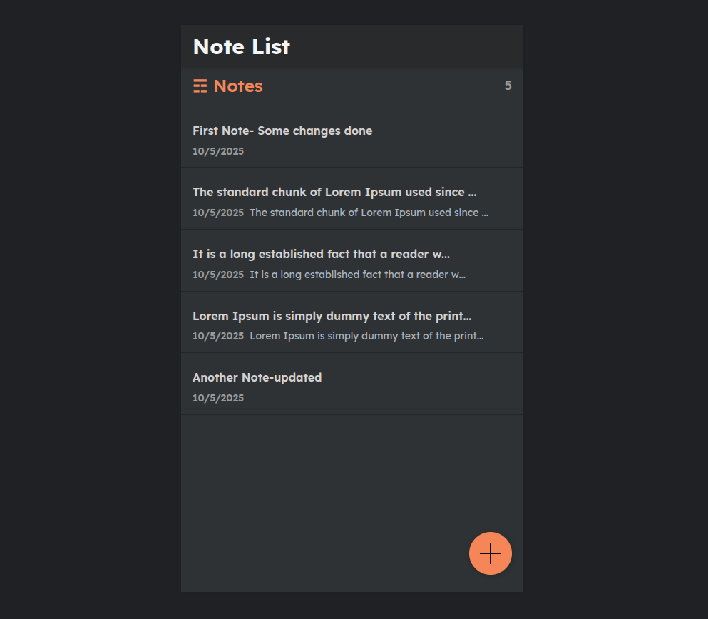

# NotesApp – Django + React Full Stack Application with Monitoring

Here is how the Notes App looks:




## Overview

**NotesApp** is a full-stack web application built with **Django (backend)** and **React (frontend)**, containerized using **Docker Compose** for easy local setup.  
It uses **PostgreSQL** as the database and integrates optional **Prometheus + Grafana monitoring** for application and system metrics.

This guide walks you through running the entire stack **locally** on your machine.

---

## Project Structure

```bash
NotesApp/
├── ansible/
│   └── files/
│       └── monitoring/
│           ├── docker-compose.yml      # Monitoring stack (Prometheus, Grafana, Node Exporter)
│           └── prometheus.yml          # Prometheus config
├── frontend/                           # React app source
├── api/                                # Django API app
├── mynotes/                            # Django project (settings, urls)
├── Dockerfile                          # Multi-stage build for React + Django
├── docker-compose.yml                  # App stack (Django + Postgres)
├── requirements.txt                    # Python dependencies
└── README.md
```

---

## Prerequisites

Before running, ensure you have the following installed:

-  **Python 3.11+**
-  **Docker & Docker Compose**
-  **Node.js** 

---

## Environment Setup

1. **Clone the repository**

```bash
git clone https://github.com/gilbert-mutai/NotesApp
cd NotesApp
```

2. **Create an `.env` file** in the project root:

```bash
# Django
SECRET_KEY=your_django_secret_key
ALLOWED_HOSTS=localhost,127.0.0.1

# Database
POSTGRES_DB=notesdb
POSTGRES_USER=notesuser
POSTGRES_PASSWORD=strongpassword
POSTGRES_HOST=db
POSTGRES_PORT=5432
```

---

##  Running Locally with Docker Compose

### Start the main app stack

```bash
docker compose up -d --build
```

This spins up:
- `notes_app` → Django + React app (listening on port 8000)
- `db` → PostgreSQL 15 database

Once built, open your browser at:  
 **http://localhost:8000**

---

##  Useful Development Commands

### View running containers
```bash
docker ps
```

### Stop the stack
```bash
docker compose down
```

### Rebuild and restart
```bash
docker compose up -d --build
```

### View logs for a specific service
```bash
docker logs -f notesapp-notes_app-1
```

---

## Running Migrations

If you’ve added or modified Django models:

```bash
docker compose exec notes_app python manage.py makemigrations
docker compose exec notes_app python manage.py migrate
```

---

## Running the Monitoring Stack (Optional)

You can also monitor your local environment using **Prometheus** and **Grafana**.

1. Navigate to the monitoring folder:
```bash
cd ansible/files/monitoring
```

2. Start the monitoring stack:
```bash
docker compose up -d
```

This will start:
- **Prometheus** → [http://localhost:9090](http://localhost:9090)
- **Grafana** → [http://localhost:3000](http://localhost:3000)
- **Node Exporter** (for local system metrics)

### Default Grafana login:
```
Username: admin
Password: admin
```

### Add Prometheus as a data source in Grafana:
- URL: `http://prometheus:9090`
- Save & Test

---

## Importing Grafana Dashboards

To visualize metrics:

1. Go to **Grafana → + → Import**
2. Use the following prebuilt dashboard IDs:
   - **Node Exporter Full (ID: 1860)** — EC2/system metrics
   - **Prometheus 2.0 Stats (ID: 3662)** — Prometheus internal metrics
3. Click **Load → Select Prometheus data source → Import**

---

## Local Development Tips

### Access Django shell
```bash
docker compose exec notes_app python manage.py shell
```

### Access PostgreSQL shell
```bash
docker compose exec db psql -U notesuser -d notesdb
```

### Collect static files (for production build)
```bash
docker compose exec notes_app python manage.py collectstatic --noinput
```

---

## Verifying Metrics

If you’ve enabled Prometheus metrics in Django (via `django-prometheus`):

```bash
curl http://localhost:8000/metrics
```

You should see metrics output like:
```
# HELP django_http_requests_total_total Total count of requests
# TYPE django_http_requests_total_total counter
...
```

---

## Tech Stack Summary

| Component | Technology |
|------------|-------------|
| Frontend | React (Vite) |
| Backend | Django REST Framework |
| Database | PostgreSQL 15 |
| Containerization | Docker & Docker Compose |
| Monitoring | Prometheus, Grafana, Node Exporter |
| OS (Dev Environment) | Ubuntu / macOS / Windows |

---

## Author

**Gilbert Mutai**  
 DevOps | Cloud Support Engineer
[gmutai1194@gmail.com](mailto:gmutai1194@gmail.com)  
[LinkedIn](https://www.linkedin.com/in/gilbert-mutai)

---

## Next Steps
- Run locally with Docker Compose  
- Integrate Prometheus & Grafana locally  
- Add CI/CD pipeline for automated builds  
- Enable `/metrics` endpoint for Django observability  

---

> _“Automate locally. Scale globally.”_ ⚡